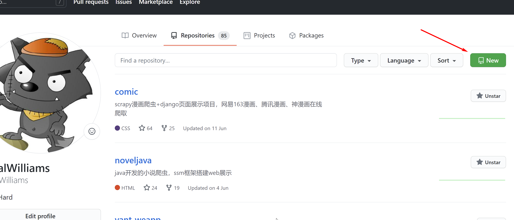
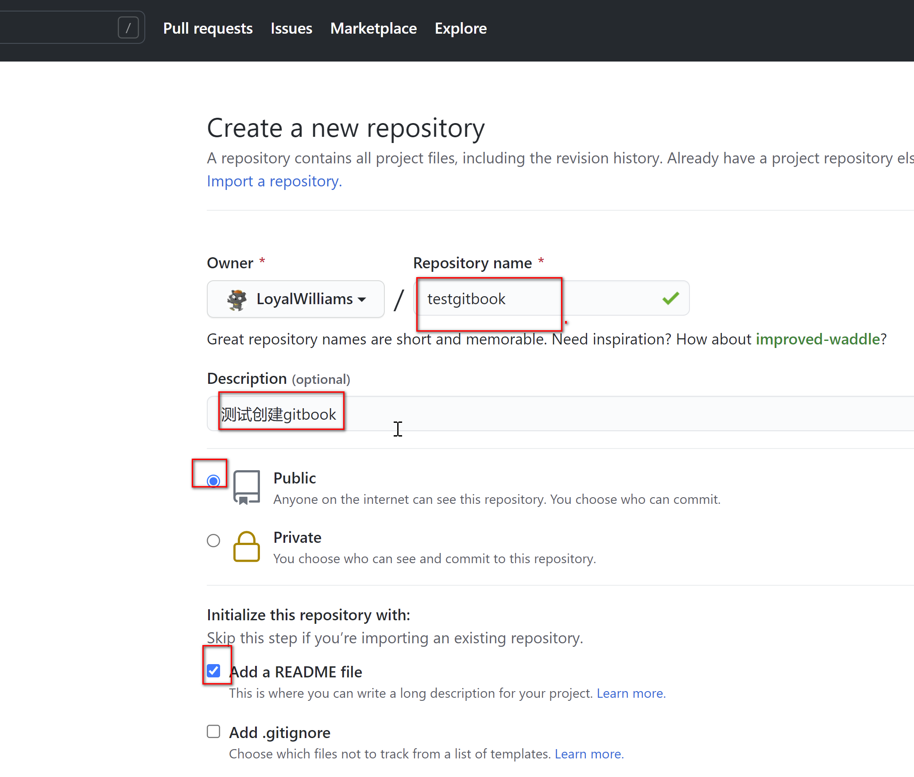
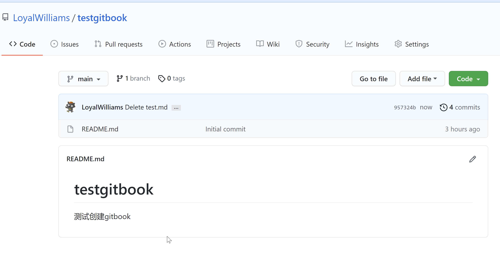
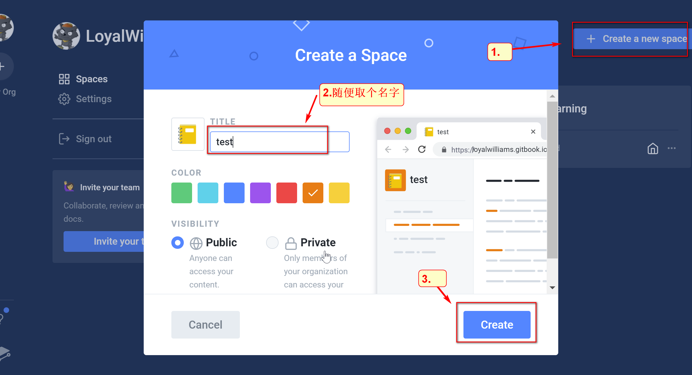
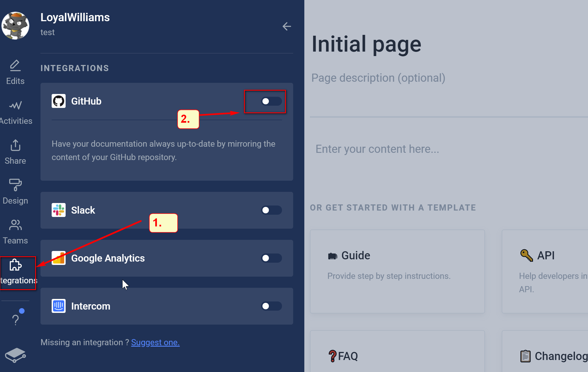
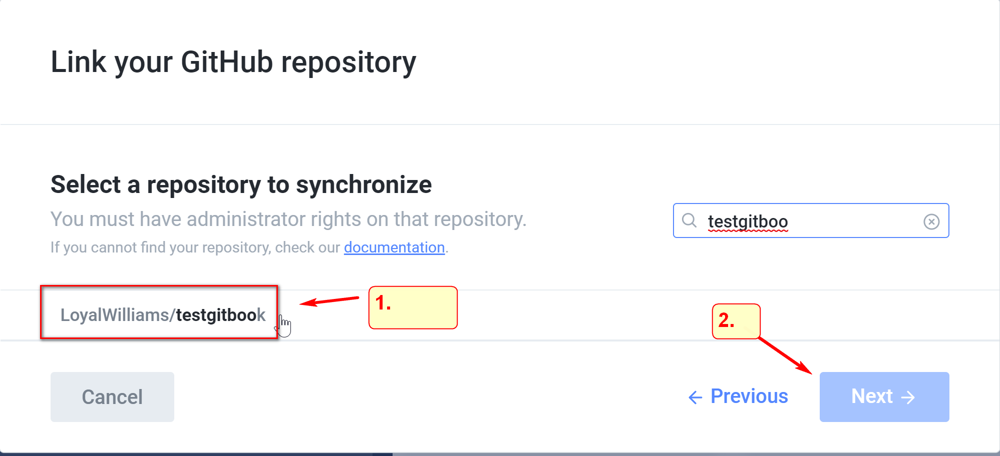
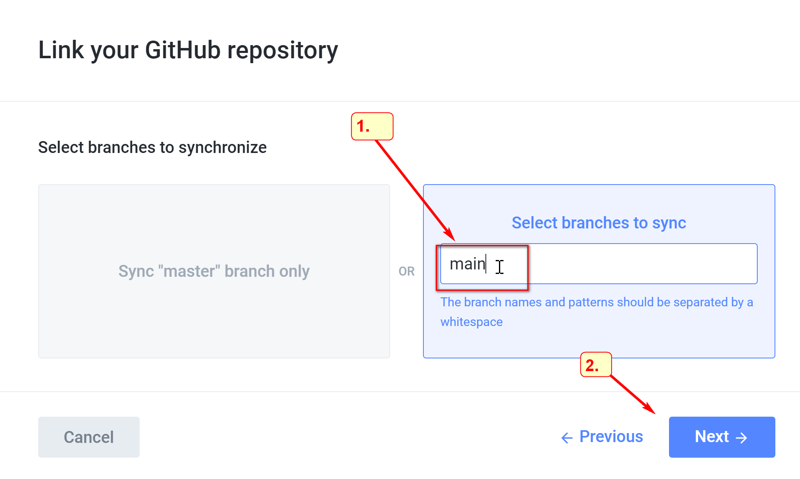
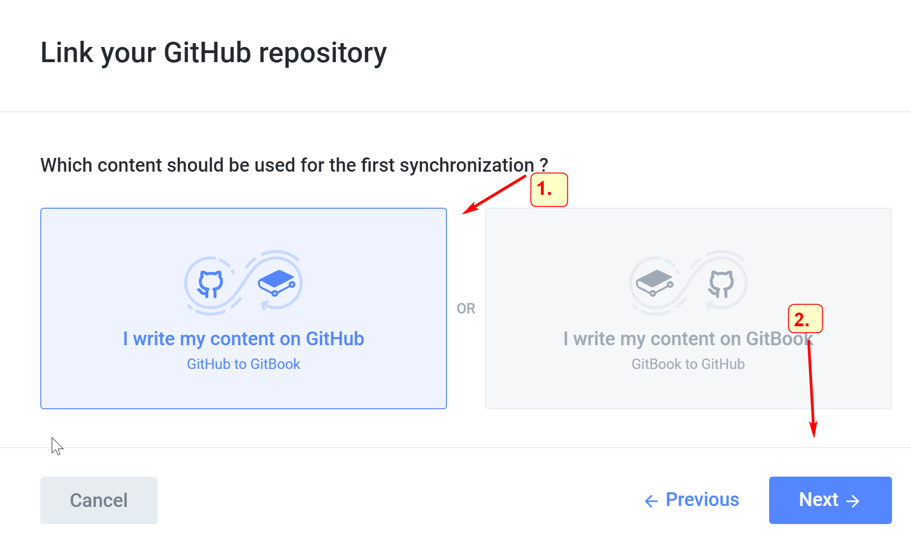
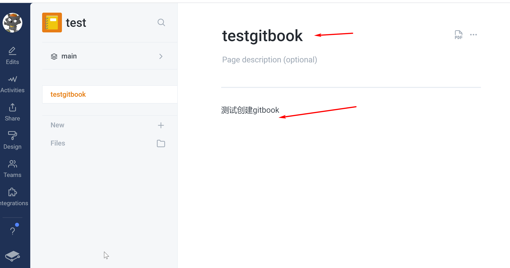

# 1.安装node

# 2.安装gitbook

去GitHub创建一个写书的仓库

去[gitbook官网](https://www.gitbook.com/)注册好一个账号，登录

选择我们在GitHub上建好的仓库，如果是第一次建立链接可能需要登录授权

写入我们需要同步的分支的名称，下一步

等待同步即可

看一下内容，已经同步成功了

以后，我们只需更新GitHub的项目，gitbook就会自动同步更新

